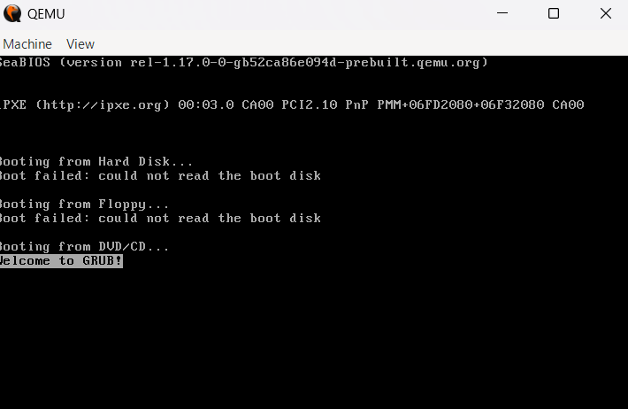
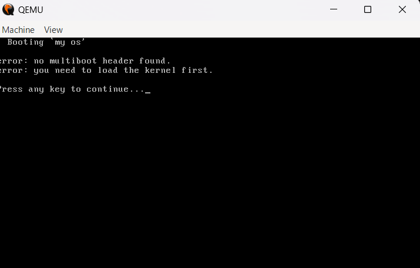

# <h1 align="center"> Operating System Development x86-64 </h1>
<h3 align="center">x86 Boot, Switch to 64bit long mode, Runs 64bit Kernel, Uses x86-64 instructions</h3>

 

<h3>27/01/2026 | Some Multiboot errors</h3>

  
  

